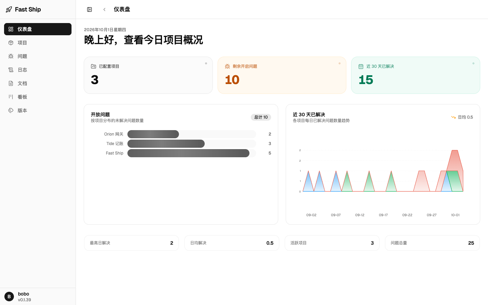
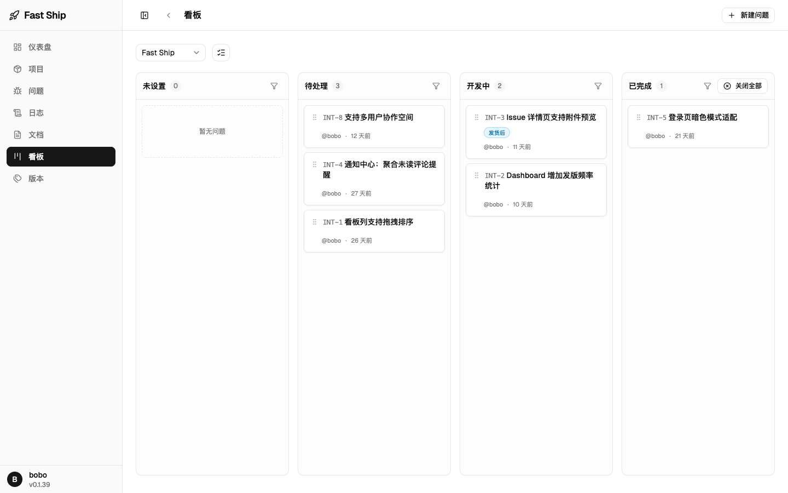
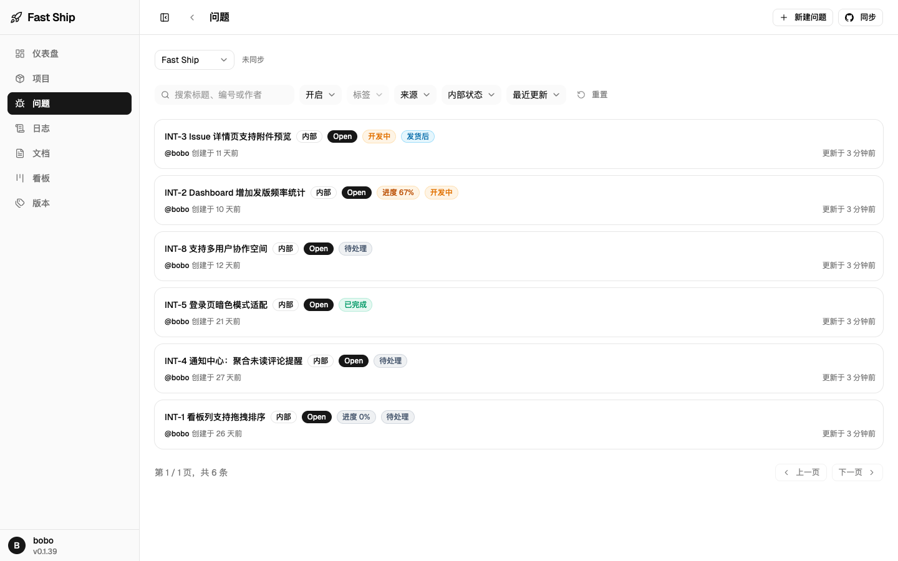
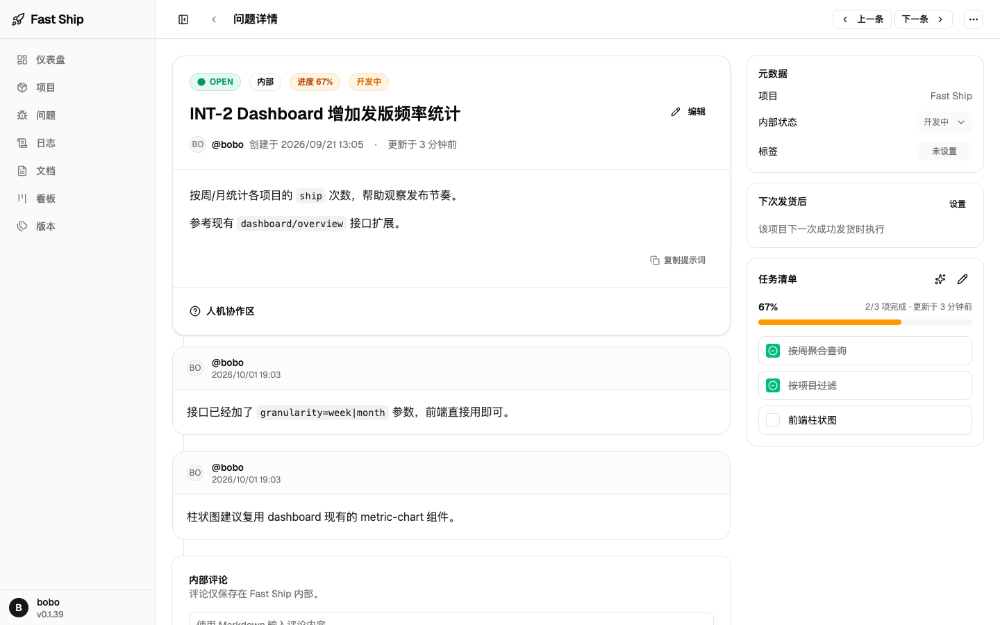
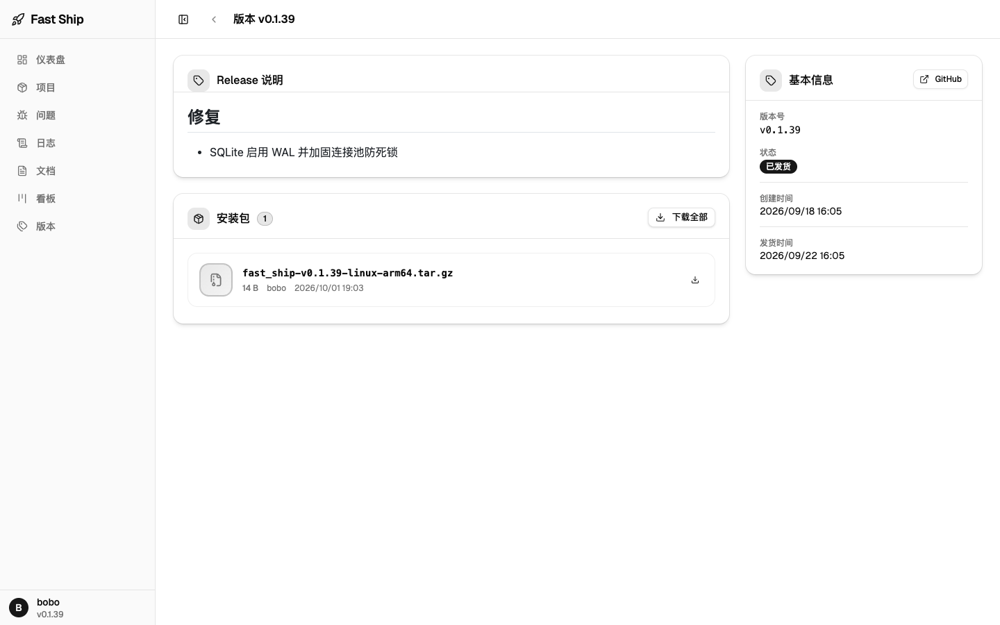
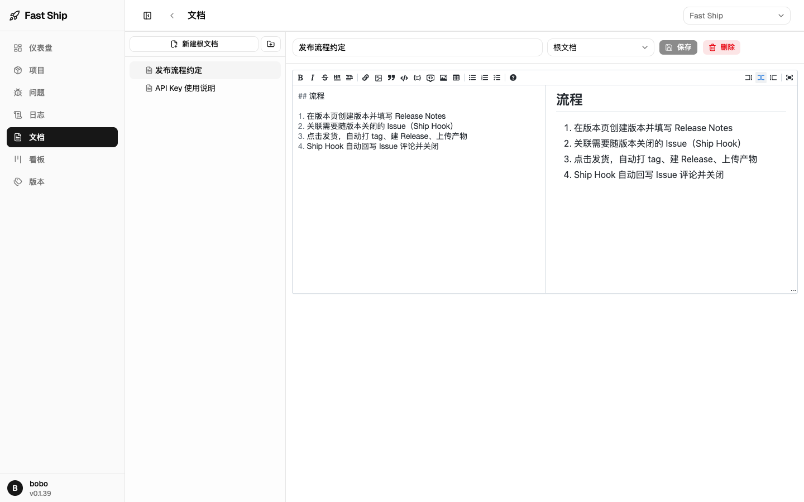
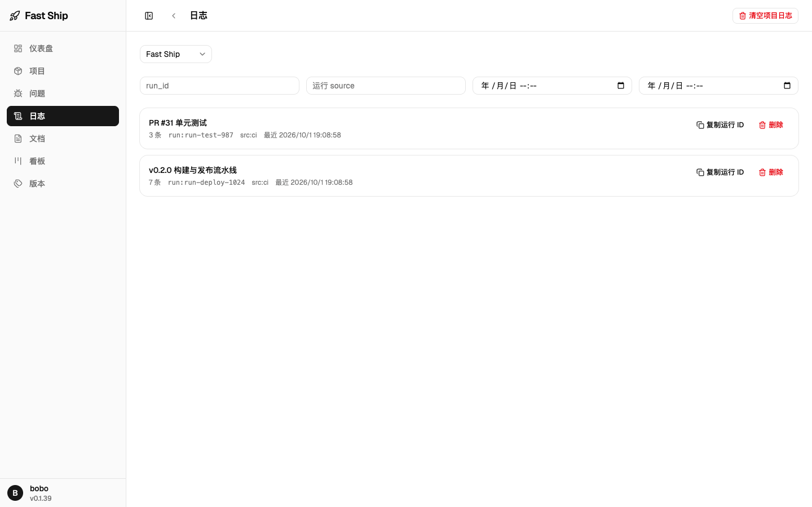

# Fast Ship

自托管的项目交付管理工具：把多个项目的 Issue、版本发布、安装包产物和运行日志收进同一个面板，并为 CI 与 Agent 自动化提供 REST API。

## 界面

| 仪表盘 | 看板 |
| --- | --- |
|  |  |

| 问题列表 | 问题详情 |
| --- | --- |
|  |  |

| 版本与发货 | 项目文档 |
| --- | --- |
|  |  |

| 运行日志 | |
| --- | --- |
|  | |

## 功能

- **项目**：每个项目可关联一个 GitHub 仓库（owner/repo + token），定时增量同步 Issue；不关联也可作为纯内部项目使用
- **问题**：列表与看板两种视图，统一展示内部和 GitHub 来源的 Issue，新建 Issue 可一键发布到 GitHub；内部工作流状态（待处理 / 开发中 / 已完成）、任务清单、评论、未读提醒、标签过滤
- **版本**：维护 Release Notes、上传安装包产物，一键发货自动完成打 tag、建 GitHub Release、上传产物；Ship Hook 可在发货成功后自动评论、关闭或流转关联 Issue
- **仪表盘**：各项目未解决 Issue 分布、近 30 天每日解决趋势
- **日志**：通过 API Key 上传运行日志，按 run 聚合、检索与清理
- **文档**：项目内 Markdown 文档，支持树状组织
- **AI 辅助**：配置自有模型接口后，可生成 Issue 标题与任务清单建议
- **Agent 集成**：`fsk_` 开头的 API Key 可访问大部分 REST 端点，人机协作区（共识 / 完成总结）供 Agent 回写工作记录，详见 [skills/fast-ship/SKILL.md](skills/fast-ship/SKILL.md)

## 技术栈

- `server/`：Go 1.25 + Gin + GORM + SQLite（WAL）
- `web/`：React 19 + Vite + Tailwind CSS 4 + React Router + TanStack Query + Zustand

## 快速开始

环境要求：Go 1.25、Node.js 22+、pnpm。

```bash
pnpm --dir web install
make dev
```

同时启动：

- 后端 API：`http://localhost:4888`
- 前端开发服务：`http://localhost:4999`（`/api` 经 Vite 代理转发到后端）

打开 `http://localhost:4999/register` 注册首个账号后进入仪表盘。按 `Ctrl+C` 同时停止前后端。

### 常用命令

| 命令 | 说明 |
| --- | --- |
| `make dev` / `dev-server` / `dev-web` | 同时或单独启动前后端开发服务 |
| `make build` | 构建后端二进制与前端产物 |
| `make test` | 运行后端与前端测试 |
| `make lint` | Go 格式检查 + `go vet`，前端 ESLint + TypeScript 校验 |
| `make tidy` / `make clean` | 整理 Go 依赖 / 清理构建产物 |

## 配置

后端默认读取 `server/configs/config.yaml`，可用 `CONFIG_PATH` 指定其他文件：

```bash
CONFIG_PATH=/path/to/config.yaml make dev-server
```

主要配置项：

| 配置 | 默认值 | 说明 |
| --- | --- | --- |
| `server.port` | `4888` | API 监听端口 |
| `server.web_dist_dir` | 空 | 设置后由后端直接托管前端 SPA（生产模式） |
| `database.path` | `./data/fast_ship.db` | SQLite 数据库文件 |
| `jwt.secret` / `jwt.expire_hours` | — / `24` | JWT 签名密钥与有效期 |
| `encryption.key` | — | 32 字节 AES 密钥，用于加密存储 GitHub Token |
| `upload.max_file_size` / `storage_path` | `500MB` / `./data/uploads` | 产物与附件上传 |
| `issues.auto_sync_*` | 开启，每 15 分钟 | GitHub Issue 自动同步 |

环境变量可覆盖配置：`FAST_SHIP_` 前缀（如 `FAST_SHIP_SERVER_MODE=release`），以及专门的 `JWT_SECRET`、`ENCRYPTION_KEY`、`FAST_SHIP_WEB_DIST_DIR`。

## 部署

根目录 [Dockerfile](Dockerfile) 构建整站镜像：编译前端产物与后端二进制，运行时由 Go 直接托管 SPA，数据落在 `/app/data`（SQLite + 上传文件）。

```bash
docker build -t fast_ship .
docker run -d -p 4888:4888 \
  -e JWT_SECRET=change-me \
  -e ENCRYPTION_KEY=change-me-32-bytes-in-production \
  -v fast-ship-data:/app/data \
  fast_ship
```

推送 `v*` 格式的 Git tag 会触发 GitHub Actions 构建并推送多架构镜像到 `ghcr.io/<owner>/<repo>`，同时打上对应 tag 与 `latest`：

```bash
git tag v1.0.0
git push origin v1.0.0
```

`server/docker-compose.yml` 提供仅后端的编排示例。

不使用 Docker 时，也可以 `make build` 后设置 `FAST_SHIP_WEB_DIST_DIR=web/dist` 直接运行单个二进制。

## 项目结构

```text
fast_ship/
├── server/               # Go 后端（cmd/server 入口，internal/ 分层）
├── web/                  # React 前端（src/routes 页面，src/lib 请求与状态）
├── scripts/dev.sh        # 开发服务编排
├── skills/               # 对外分发的 Agent 技能（API 用法）
├── .agents/skills/       # 仓库内部 Agent 技能（发版流程、端到端验证）
├── docs/screenshots/     # 界面截图
├── Dockerfile            # 整站镜像
└── Makefile              # 统一命令入口
```

## License

[MIT](LICENSE)
